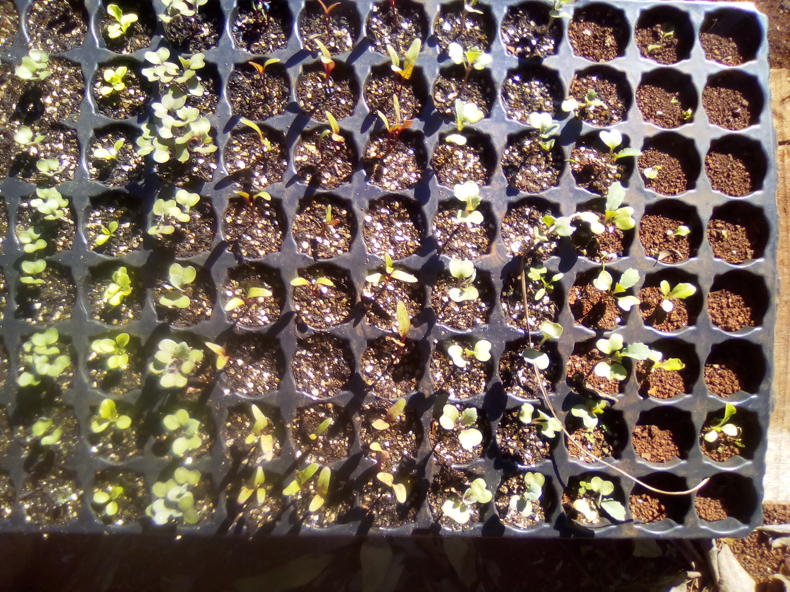

Recipes of code in reStructuredText
======================================

This is a template with some pieces of code/text in rst_ directives.

.. _rst: https://docutils.sourceforge.io/rst.html
.. _UDL: https://www.udl.cat/

Using links
-----------------
The text below contains links that look like "(quickref__)".  These
are relative links that point to the `Quick reStructuredText`_ user
reference.  If these links don't work, please refer to the `master
quick reference`_ document.

__
.. _Quick reStructuredText: quickref.html
.. _master quick reference:
   https://docutils.sourceforge.io/docs/user/rst/quickref.html

Using simple text
-------------------
This is a text in bold **Write the docs**.

This is italic text *Write the docs*.

Tables
----------

.. list-table::
   :widths: 15 15 70
   :header-rows: 1

   * - First Name
     - Last Name
     - Residence
   * - Elizabeth
     - Bennett
     - Longbourne
   * - Fitzwilliam
     - Darcy
     - Pemberley

.. table:: Truth table for "not"
   :widths: auto

   =====  =====
     A    not A
   =====  =====
   False  True
   True   False
   =====  =====

.. table:: Truth table for "not"
   :widths: auto

   ======================================  =========
    COLUMN 01                              COLUMN 02
   ======================================  =========
    A value here                           Single row here.
    .. math:: e^{i\pi} + 1 = 0             Lorem Ipsum is simply dummy text of the printing and typesetting industry. Lorem Ipsum has been the industry's standard dummy text ever since the 1500s, when an unknown printer took a galley of type and scrambled it to make a type specimen book.
   ======================================  =========

Math symbols
--------------

Defining an equation after this line.

.. math:: e^{i\pi} + 1 = 0
   :label: euler

Euler's identity, equation :math:numref:`euler`, was elected one of the
most beautiful mathematical formulas.

Managing images
-----------------
This is the name of an image IMG_20180617_123230.jpg
An image.

A figure with caption.

  This is the caption

Managing code blocks
--------------------

Python code ahead.

.. code:: python

  def my_function():
      "just a test"
      print 8/2

Bash code ahead.

.. code-block:: bash

    #!/bin/bash
    echo "---- SCRIPT INFORMATION ---";
    MY_VARIABLE=1;
    echo "Enter value ->; read $MY_VARIABLE;
    echo "Some text here -> "$MY_VARIABLE;

Calling MATLAB code.

.. code-block:: matlab

    IRGBPath=fullfile(datasetImagesPath, imageName);
    IMaskPath=fullfile(datasetMasksPath, imageMaskName);
    IRGB=imread(IRGBPath);
    IMask=imread(IMaskPath);
    DepthChannel=transformed_depth;  % get channel from transformed depth matrix

